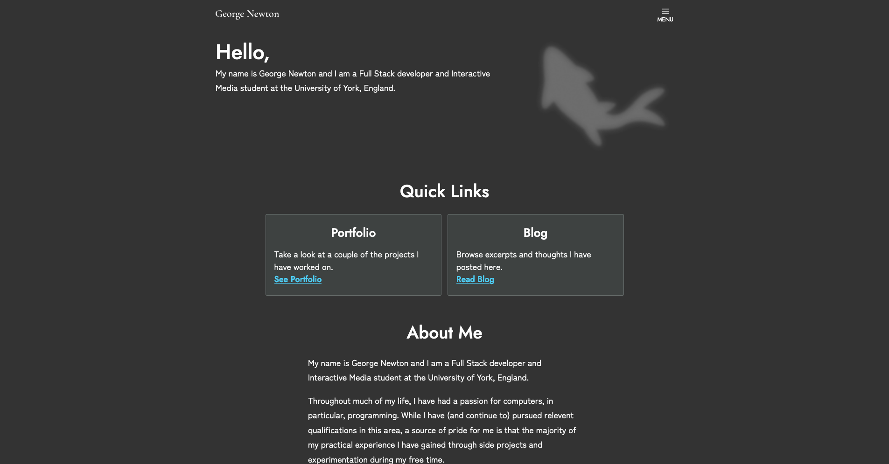

I first launched my portfolio website in 2022, during my third year of university. I had been meaning to develop one for a while, and had toyed with different designs, but never found a design I was completely happy with. The end result (at the time of writing) was developed rather hurriedly during the summer holidays because I didn't think I would get another chance, and because of this, I made the decision to skip out on features here and there, and not obsess too much over the quality of the site.

The design of the site comes from my love of Japanese culture, and features a copious number of koi fish motifs (Or rather, shadows of koi fish). I also wanted the site to have a minimalistic feel, which I feel I achieved fairly well, there are a minimal number of colours on the page. On the topic of colours, I also wanted the site to support a dark theme so both the background texture and fish motif have a negative version which can be activated by way of the `prefers-color-scheme` media query. 

The architecture of the site is also fairly simple. I decided I would try out [Astro](https://astro.build), a fairly new static site generator that really does a good job of minimizing the amount of Javascript sent to the client. To make things even better, it supports all of the most popular Javascript Frameworks simultaneously. As you may be able to tell I am very pleased with my experience of it so far, it is exactly the type of SSG I had been wanting for some time.

I also gave AlpineJS a go for the first time, my Framework of choice is usually VueJS, since it is the one I am most familiar with, however I find great ennjoyment in exploring new technologies, and I was attracted by the minimalism of Alpine, which as it turns out has a fair amount of similarity to VueJS. The navbar was very easy to construct, in fact, as I was looking over the documentation for Alpine, I fairly quickly came across their [Components](https://alpinejs.dev/components) library. While I still intend to make improvements to the Navbar, for instance by adding more keyboard functionality, the dropdown code which is the only free component of Alpine Components, is perfect for now. The blog and portfolio pages also use Alpine to dynamically list blog posts, the reason for this is that I wanted to implement pagination for these pages, but haven't gotten round to it yet. 

Another part that I feel is worth mentioning is the CSS. For the CSS, I used a library named [UnoCSS](https://github.com/unocss/unocss) which is very similar to librarys such as WindiCSS and TailwindCSS. To see how it differs from the aforementioned libraries, read [this post by it's creator](https://antfu.me/posts/reimagine-atomic-css).

Finally, a look at the CMS. Almost all of the projects and experiments I have worked on in the past year or two have used or been related to a headless CMS named [Storyblok](https://storyblok.com). I am a huge fan of Storyblok, and I may some day end up using it for my portfolio site as well, but for now I have decided to use [NetlifyCMS](https://www.netlifycms.org) instead. My reason for this is that I need to be familiar with more than one technology or platform, and although I have experience with NetlifyCMS and others already, I realised that I should keep refreshing my memory every now and again. Another reason for the decision is that configuring Storyblok can easily become more complicated and/or time-consuming than I needed for such a small portfolio site, especially since I will likely be the only one updating it. Additionally, NetlifyCMS stores all the blog content in markdown files inside a git repository, rather than it existing somewhere out in the cloud like Storyblok, which I feel is more fitting for a web developer's personal portfolo.

Thank you for reading.
